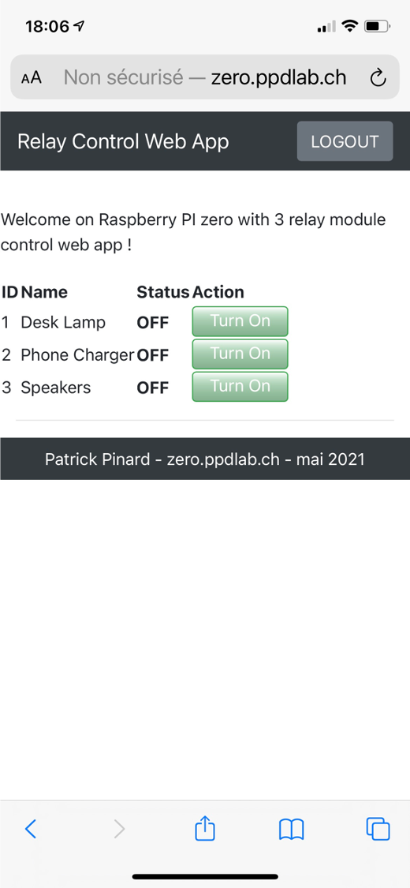
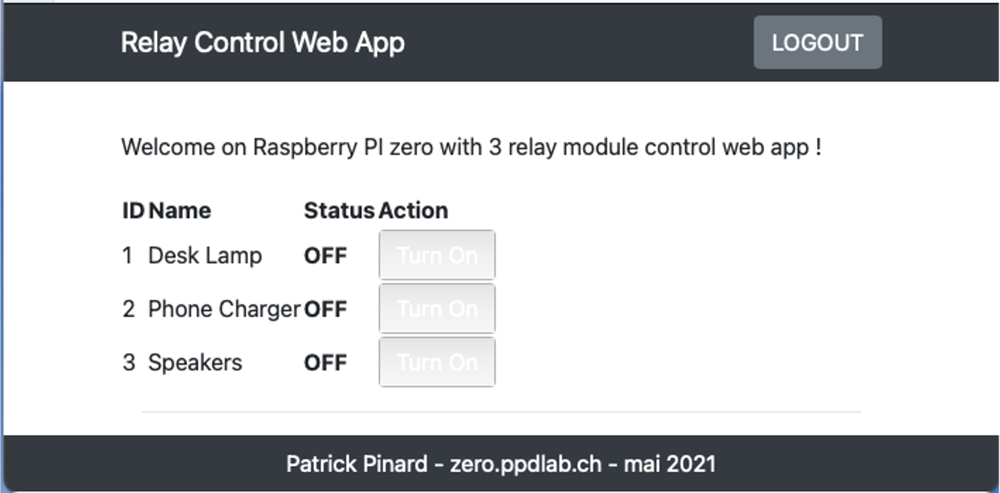
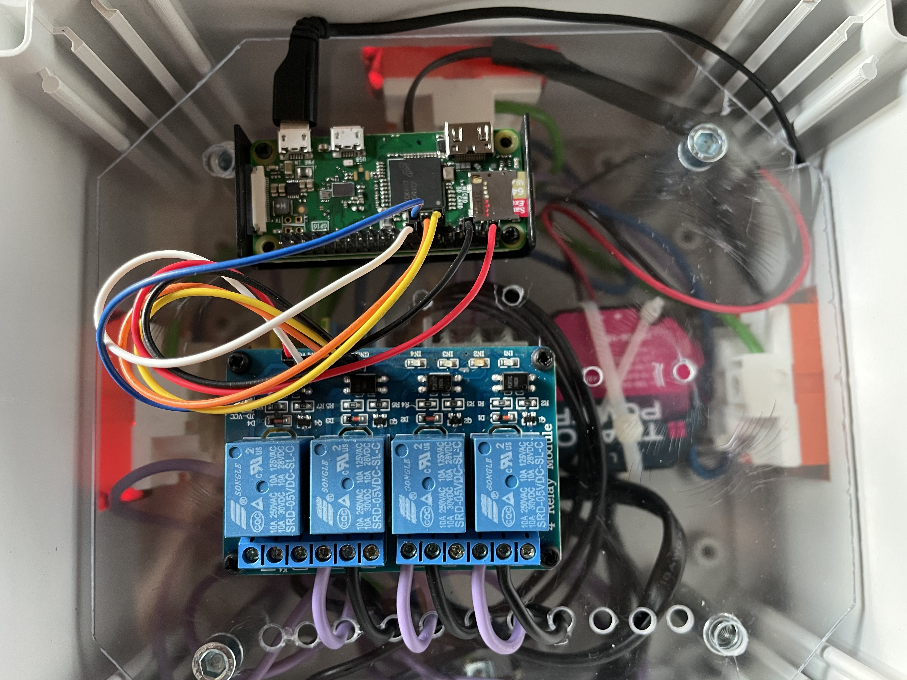

# Relay Box

# Module 4x relais 240V
Boitier avec 4 prises 240V commandées via une interface Web en utilisant les technologies Restful API, Flask, bootstrap sur une Raspberry Pi zero.

Ce projet consiste à regrouper différentes technologies pour piloter un boitier électrique grâce à une application web simple via le wifi de la maison.

# PIN Board vs GPIO Details :

| Relays  | BOARD  | GPIO |
|---------|--------|------|
| Relay 1 |     11 |  17  |
| Relay 2 |     13 |  27  |
| Relay 3 |     15 |  22  |
| Relay 4 |     16 |  23  |

# Interface

Depuis un smartphone :

Depuis un PC :

# Boitier
Le boitier est construit en séparant la partie électrique 240V de la commande (Raspberry Pi zero et module relais) au maximum.

# Code
Le code est simple et utilise GPIO, Flask, Bootstrap et Logging.

